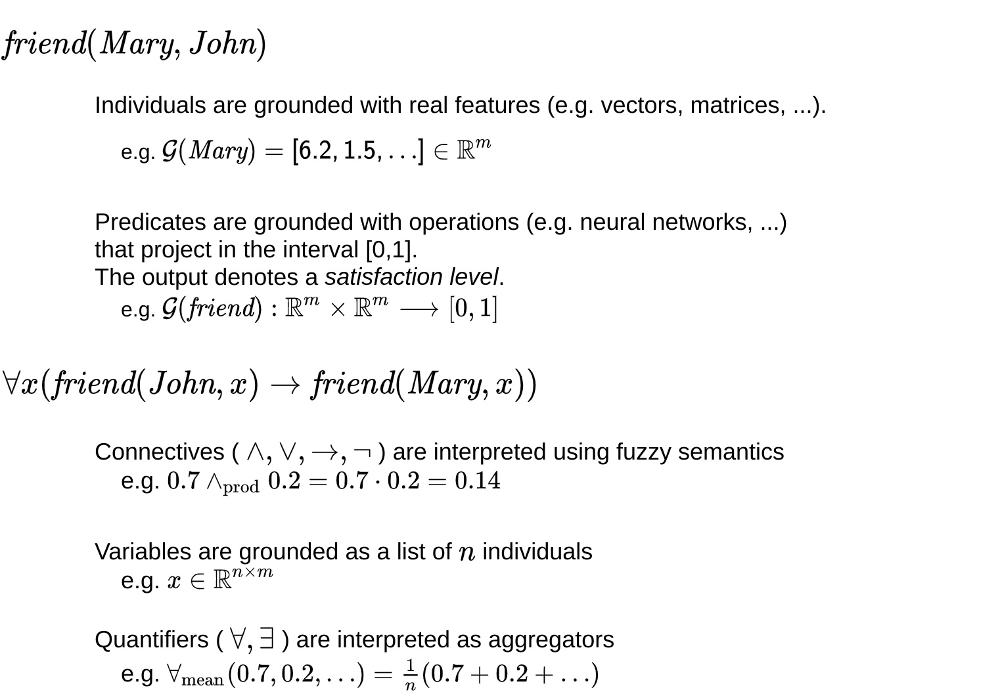
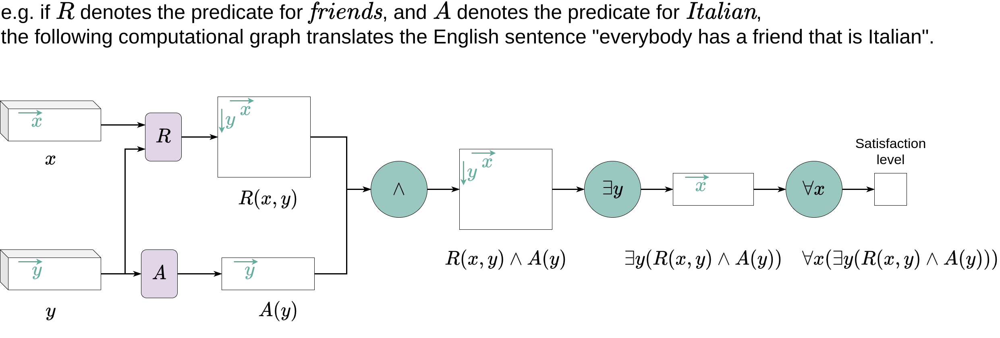
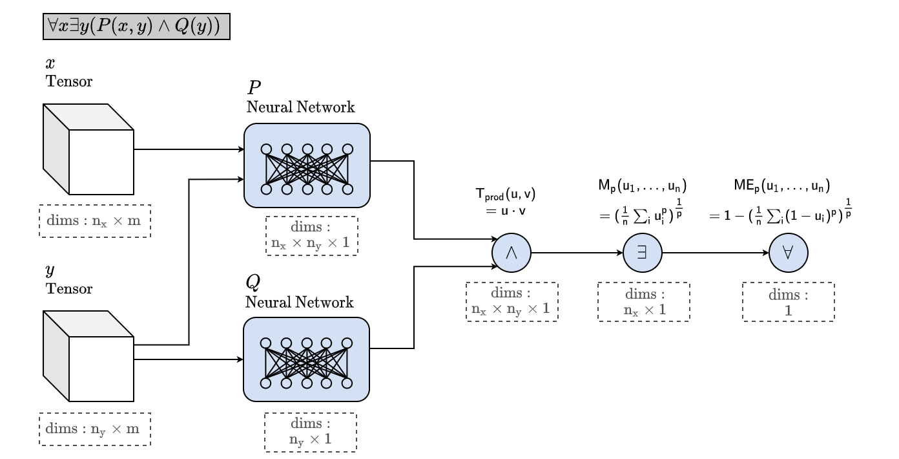
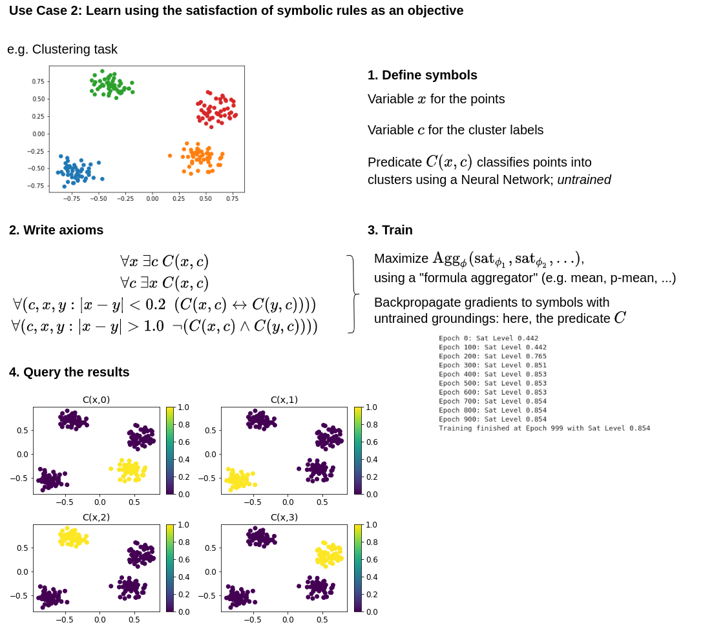

# Logic Tensor Networks (LTN)

Logic Tensor Network (LTN) is a neurosymbolic framework that supports querying, learning and reasoning with both rich data and rich abstract knowledge about the world.
LTN uses a differentiable first-order logic language, called Real Logic, to incorporate data and logic. The figure below describes features of Real Logic.

The [example page](https://github.com/logictensornetworks/logictensornetworks/tree/master/examples) gives a non-exhaustive list of projects that use LTN. 
Also, check out the [PyTorch implementation](https://github.com/tommasocarraro/LTNtorch).

## Description



LTN converts Real Logic formulas (e.g. `∀x(cat(x) → ∃y(partOf(x,y)∧tail(y)))`) into [TensorFlow](https://www.tensorflow.org/) computational graphs.
Such formulas can express complex queries about the data, prior knowledge to satisfy during learning, statements to prove ... The next two figures describe how Real Logic sentences can represent computational graphs (inputs are on the left, outputs are on the right).





[[Paper]](https://www.sciencedirect.com/science/article/abs/pii/S0004370221002009) -- [[Preprint]](https://arxiv.org/pdf/2012.13635.pdf)

Cite as:
```
@article{badreddine2022logic,
title = {Logic Tensor Networks},
journal = {Artificial Intelligence},
volume = {303},
pages = {103649},
year = {2022},
issn = {0004-3702},
doi = {https://doi.org/10.1016/j.artint.2021.103649},
author = {Samy Badreddine and Artur {d'Avila Garcez} and Luciano Serafini and Michael Spranger},
keywords = {Neurosymbolic AI, Deep learning and reasoning, Many-valued logics}
}
```


## Installation

For the latest release version, install via pip. To install the core dependencies, run:
```
pip install ltn
```

If you need the dependencies used in the examples, run:
```
pip install ltn[examples]
```

For the latest development version, clone the github repository and install it locally (with or without dependency modifier).
```
pip install -e <local project path>
```

## Repository structure

- `ltn/core.py` -- core system for defining constants, variables, predicates, functions and formulas,
- `ltn/fuzzy_ops.py` -- a collection of fuzzy logic operators defined using Tensorflow primitives,
- `ltn/utils.py` -- a collection of useful functions,
- `tutorials/` -- tutorials to start with LTN,
- `examples/` -- various problems approached using LTN,
- `tests/` -- tests.

## Getting Started

### Tutorials

`tutorials/` contains a walk-through of LTN. In order, the tutorials cover the following topics:
1. [Grounding in LTN part 1](https://nbviewer.jupyter.org/github/logictensornetworks/logictensornetworks/blob/master/tutorials/1-grounding_non_logical_symbols.ipynb): Real Logic, constants, predicates, functions, variables,
2. [Grounding in LTN part 2](https://nbviewer.jupyter.org/github/logictensornetworks/logictensornetworks/blob/master/tutorials/2-grounding_connectives.ipynb): connectives and quantifiers (+ [complement](https://nbviewer.jupyter.org/github/logictensornetworks/logictensornetworks/blob/master/tutorials/2b-operators_and_gradients.ipynb): choosing appropriate operators for learning),
3. [Learning in LTN](https://nbviewer.jupyter.org/github/logictensornetworks/logictensornetworks/blob/master/tutorials/3-knowledgebase_and_learning.ipynb): using satisfiability of LTN formulas as a training objective,
4. [Reasoning in LTN](https://nbviewer.jupyter.org/github/logictensornetworks/logictensornetworks/blob/master/tutorials/4-reasoning.ipynb): measuring if a formula is the logical consequence of a knowledgebase.

The tutorials are implemented using jupyter notebooks.

### Examples

`examples/` contains a series of experiments. Their objective is to show how the language of Real Logic can be used to specify a number of tasks that involve learning from data and reasoning about logical knowledge. Examples of such tasks are: classification, regression, clustering, link prediction.

- The [binary classification](https://nbviewer.jupyter.org/github/logictensornetworks/logictensornetworks/blob/master/examples/binary_classification/binary_classification.ipynb) example illustrates in the simplest setting how to ground a binary classifier as a predicate in LTN, and how to feed batches of data during training,
- The multiclass classification examples ([single-label](https://nbviewer.jupyter.org/github/logictensornetworks/logictensornetworks/blob/master/examples/multiclass_classification/multiclass-singlelabel.ipynb), [multi-label](https://nbviewer.jupyter.org/github/logictensornetworks/logictensornetworks/blob/master/examples/multiclass_classification/multiclass-multilabel.ipynb)) illustrate how to ground predicates that can classify samples in several classes,
- The [MNIST digit addition](https://nbviewer.jupyter.org/github/logictensornetworks/logictensornetworks/blob/master/examples/mnist/single_digits_addition.ipynb) example showcases the power of a neurosymbolic approach in a classification task that only provides groundtruth for some final labels (result of the addition), where LTN is used to provide prior knowledge about intermediate labels (possible digits used in the addition),
- The [regression](https://nbviewer.jupyter.org/github/logictensornetworks/logictensornetworks/blob/master/examples/regression/regression.ipynb) example illustrates how to ground a regressor as a function symbol in LTN,
- The [clustering](https://nbviewer.jupyter.org/github/logictensornetworks/logictensornetworks/blob/master/examples/clustering/clustering.ipynb) example illustrates how LTN can solve a task using first-order constraints only, without any label being given through supervision,
- The [Smokes Friends Cancer](https://nbviewer.jupyter.org/github/logictensornetworks/logictensornetworks/blob/master/examples/smokes_friends_cancer/smokes_friends_cancer.ipynb) example is a classical link prediction problem of Statistical Relational Learning where LTN learns embeddings for individuals based on fuzzy groundtruths and first-order constraints.

The examples are presented with both jupyter notebooks and Python scripts.





## License

This project is licensed under the MIT License - see the [LICENSE](https://github.com/logictensornetworks/logictensornetworks/blob/master/LICENSE) file for details.

## Acknowledgements

LTN has been developed thanks to active contributions and discussions with the following people (in alphabetical order):
- Alessandro Daniele (FBK)
- Artur d’Avila Garcez (City)
- Benedikt Wagner (City)
- Emile van Krieken (VU Amsterdam)
- Francesco Giannini (UniSiena)
- Giuseppe Marra (UniSiena)
- Ivan Donadello (FBK)
- Lucas Bechberger (UniOsnabruck)
- Luciano Serafini (FBK)
- Marco Gori (UniSiena)
- Michael Spranger (Sony AI)
- Michelangelo Diligenti (UniSiena)
- Samy Badreddine (Sony AI)
- Tommaso Carraro (FBK)
